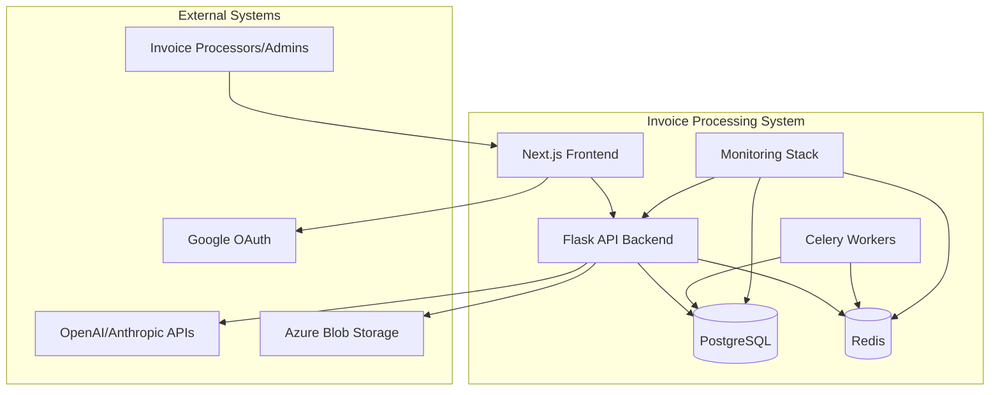
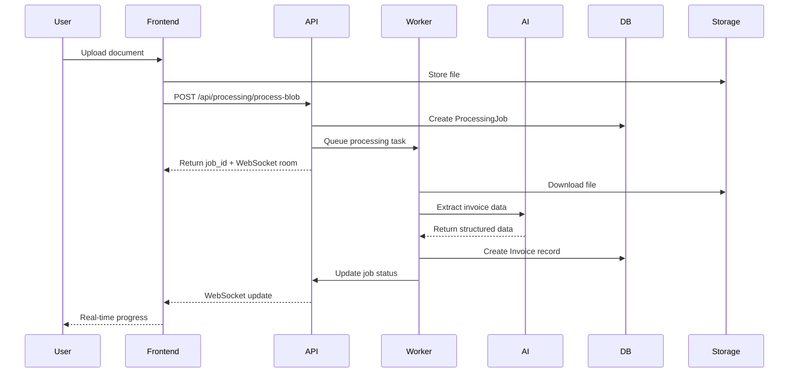
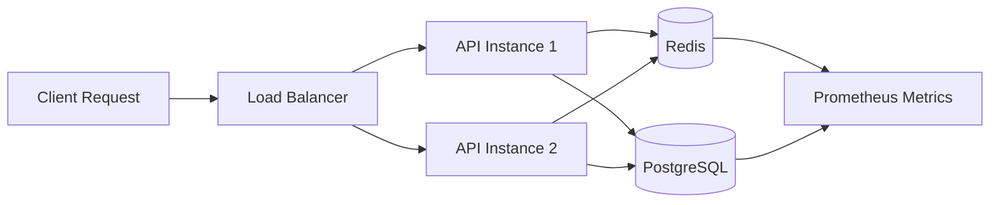

# Invoice Processing System - Architecture Documentation

## Executive Summary

This document provides comprehensive architecture documentation for the Invoice Processing System, a cloud-native application designed for document processing, invoice extraction, and management with real-time capabilities.

## Architecture Comparison Analysis

### Current Deployment Options

| Approach | Root DEPLOYMENT.md | Backend Docker |
|----------|-------------------|----------------|
| **Storage** | Vercel Blob Storage | Azure Blob Storage |
| **Database** | Azure PostgreSQL | Azure PostgreSQL + Docker |
| **Cache** | Not specified | Redis (containerized) |
| **Monitoring** | Azure App Insights + Vercel | Prometheus + Grafana |
| **Container Strategy** | Azure Container Instances | Azure Container Apps |
| **Best For** | Simple deployment | Production-ready with monitoring |

### Recommended Approach: Docker-Based Architecture

The Docker-based approach (`backend/docker/`) is **optimal** for your Azure container goals because:

1. **Complete monitoring stack**: Includes Prometheus, Grafana, AlertManager
2. **Production-ready**: Redis caching, Celery workers, health checks
3. **Azure Container Apps compatible**: Easy migration path
4. **Scalable**: Separate worker processes and monitoring
5. **Development-friendly**: Local testing matches production

---

## System Context (C4 Level 1)



## Container Architecture (C4 Level 2)

### Core Services

#### 1. **Flask API Service** (`case-study-api`)
- **Port**: 8000
- **Purpose**: REST API with WebSocket support
- **Dependencies**: PostgreSQL, Redis
- **Health Check**: `/api/health` endpoint
- **Scaling**: Horizontal (multiple instances)

#### 2. **PostgreSQL Database** (`case-study-postgres`)
- **Port**: 5433 (external)
- **Image**: `pgvector/pgvector:pg16`
- **Features**: Vector search capabilities for AI embeddings
- **Persistence**: Named volume `postgres_data`
- **Backup Strategy**: Azure Database backup integration

#### 3. **Redis Cache/Broker** (`case-study-redis`)
- **Port**: 6379
- **Purpose**: Session cache, message broker, task queue
- **Persistence**: Named volume `redis_data`
- **High Availability**: Redis Sentinel (production)

#### 4. **Celery Workers** (`case-study-worker`)
- **Purpose**: Background document processing
- **Concurrency**: 2 workers per container
- **Task Types**: Document extraction, AI processing
- **Monitoring**: Celery Flower dashboard

### Monitoring Stack

#### 1. **Prometheus** (Metrics Collection)
- **Port**: 9090
- **Retention**: 30 days
- **Targets**: API, Database, Redis, System metrics
- **Alert Rules**: Performance and health monitoring

#### 2. **Grafana** (Visualization)
- **Port**: 3001
- **Dashboards**: System overview, application metrics
- **Data Sources**: Prometheus, PostgreSQL
- **Authentication**: Admin password protected

#### 3. **AlertManager** (Alerting)
- **Port**: 9093
- **Integrations**: Email, Slack, webhook notifications
- **Rules**: CPU/Memory thresholds, service failures

#### 4. **Exporters**
- **Node Exporter** (9100): System metrics
- **PostgreSQL Exporter** (9187): Database metrics
- **Redis Exporter** (9121): Cache metrics

---

## Azure Deployment Architecture

### Azure Container Apps Strategy

```yaml
# azure-deployment.yml
apiVersion: containerapps.io/v1beta1
kind: ContainerApp
metadata:
  name: invoice-processing-system
spec:
  containers:
    - name: api
      image: youracr.azurecr.io/case-study-api:latest
      resources:
        cpu: 1.0
        memory: 2Gi
      env:
        - name: DATABASE_URL
          secretRef: postgres-connection
        - name: REDIS_URL
          secretRef: redis-connection
      probes:
        httpGet:
          path: /api/health
          port: 8000

    - name: worker
      image: youracr.azurecr.io/case-study-worker:latest
      resources:
        cpu: 0.5
        memory: 1Gi
      env:
        - name: DATABASE_URL
          secretRef: postgres-connection
        - name: CELERY_BROKER_URL
          secretRef: redis-connection
```

### Azure Services Integration

1. **Azure Container Registry**: Store container images
2. **Azure Container Apps**: Run containerized services
3. **Azure Database for PostgreSQL**: Managed database
4. **Azure Cache for Redis**: Managed Redis
5. **Azure Monitor**: Centralized logging and monitoring
6. **Azure Key Vault**: Secrets management
7. **Azure Blob Storage**: File storage

---

## Component Architecture (C4 Level 3)

### Flask API Components

```
app/
├── routes/
│   ├── health.py           # Health checks and metrics
│   ├── invoices.py         # Invoice CRUD operations
│   ├── processing.py       # Document processing
│   ├── async_processing.py # Async job management
│   ├── admin.py           # Admin monitoring
│   └── realtime.py        # WebSocket handlers
├── models/
│   ├── invoice.py         # Invoice data models
│   ├── processing_job.py  # Job tracking
│   ├── file_storage.py    # File metadata
│   └── user.py           # User management
├── services/
│   ├── document_processor.py    # Core processing
│   ├── llm_extractor.py        # AI extraction
│   ├── background_processor.py # Celery tasks
│   ├── websocket_service.py    # Real-time updates
│   └── metrics_service.py      # Prometheus metrics
└── utils/
    └── file_utils.py      # File handling utilities
```

### Data Models

#### Invoice Model
```python
class Invoice(db.Model):
    id = db.Column(UUID, primary_key=True)
    invoice_number = db.Column(String(50))
    total_amount = db.Column(Numeric(10,2))
    customer_id = db.Column(UUID, ForeignKey('companies.id'))
    processed_by_llm = db.Column(Boolean, default=False)
    confidence_score = db.Column(Numeric(3,2))
    # ... additional fields
```

#### Processing Job Model
```python
class ProcessingJob(db.Model):
    id = db.Column(UUID, primary_key=True)
    status = db.Column(Enum(JobStatus))
    job_type = db.Column(String(50))
    progress = db.Column(Integer, default=0)
    result_data = db.Column(JSON)
    # ... additional fields
```

---

## Data Flow Architecture

### Document Processing Pipeline



### API Request Flow



---

## Security Architecture

### Authentication & Authorization

1. **JWT Token Flow**
   - Google OAuth integration
   - Stateless JWT tokens
   - Role-based access control (RBAC)

2. **File Access Security**
   - User-scoped file access
   - Time-limited blob URLs
   - File type validation

3. **API Security**
   - CORS restrictions
   - Rate limiting (planned)
   - Input validation and sanitization

### Security Controls

```python
# JWT Verification Decorator
@verify_jwt_token
def secure_endpoint():
    user_id = request.user_id  # Extracted from JWT
    # User-scoped operations only
```

---

## Monitoring & Observability

### Metrics Collection

1. **Application Metrics**
   - Request rate, response time, error rate
   - Processing job metrics
   - WebSocket connection metrics

2. **Infrastructure Metrics**
   - CPU, memory, disk usage
   - Database connection pool
   - Redis cache hit ratio

3. **Business Metrics**
   - Document processing throughput
   - AI extraction accuracy
   - User activity patterns

### Health Checks

```python
@app.route('/health')
def health_check():
    return {
        'status': 'healthy',
        'service': 'case-study-invoice-extraction',
        'version': '1.0.0'
    }

@app.route('/health/detailed')
def detailed_health():
    # Check database, Redis, AI services
    # Return comprehensive status
```

---

## Deployment Strategies

### Local Development

```bash
# Start full stack
cd backend/docker
docker-compose --profile full up -d

# Services available:
# - API: http://localhost:8000
# - Grafana: http://localhost:3001
# - Prometheus: http://localhost:9090
# - Flower: http://localhost:5555
```

### Azure Production Deployment

1. **Container Registry Setup**
```bash
az acr create --name casestudyacr --resource-group rg-casestudy
az acr login --name casestudyacr
```

2. **Build and Push Images**
```bash
docker build -t casestudyacr.azurecr.io/api:latest ./api
docker build -t casestudyacr.azurecr.io/worker:latest ./worker
docker push casestudyacr.azurecr.io/api:latest
docker push casestudyacr.azurecr.io/worker:latest
```

3. **Container Apps Deployment**
```bash
az containerapp create \
  --name case-study-api \
  --resource-group rg-casestudy \
  --environment container-env \
  --image casestudyacr.azurecr.io/api:latest \
  --target-port 8000 \
  --ingress external \
  --min-replicas 2 \
  --max-replicas 10
```

---

## Infrastructure as Code

### Terraform Configuration

```hcl
# main.tf
resource "azurerm_container_app_environment" "main" {
  name                = "case-study-env"
  location            = var.location
  resource_group_name = azurerm_resource_group.main.name
}

resource "azurerm_container_app" "api" {
  name                          = "case-study-api"
  container_app_environment_id  = azurerm_container_app_environment.main.id
  resource_group_name          = azurerm_resource_group.main.name
  revision_mode                = "Single"

  template {
    min_replicas = 2
    max_replicas = 10

    container {
      name   = "api"
      image  = "casestudyacr.azurecr.io/api:latest"
      cpu    = "1.0"
      memory = "2Gi"

      env {
        name        = "DATABASE_URL"
        secret_name = "postgres-connection"
      }
    }
  }

  ingress {
    external_enabled = true
    target_port      = 8000

    traffic_weight {
      percentage = 100
    }
  }
}
```

---

## Scalability & Performance

### Horizontal Scaling Strategy

1. **API Tier**: Auto-scale based on CPU/memory
2. **Worker Tier**: Scale based on queue length
3. **Database**: Read replicas for reporting
4. **Cache**: Redis cluster for high availability

### Performance Optimizations

1. **Database Optimization**
   - Connection pooling
   - Query optimization
   - Indexing strategy

2. **Caching Strategy**
   - Redis for session data
   - Application-level caching
   - CDN for static assets

3. **Background Processing**
   - Async job processing
   - Queue prioritization
   - Batch processing optimization

---

## Disaster Recovery & Business Continuity

### Backup Strategy

1. **Database Backups**
   - Automated daily backups
   - Point-in-time recovery
   - Cross-region replication

2. **File Storage**
   - Azure Blob Storage redundancy
   - Geo-redundant storage (GRS)
   - Backup retention policies

### High Availability

1. **Service Level**
   - Multiple availability zones
   - Auto-failover mechanisms
   - Health check monitoring

2. **Data Level**
   - Database clustering
   - Redis Sentinel
   - File storage replication

---

## Cost Optimization

### Resource Optimization

1. **Container Sizing**
   - Right-sizing based on metrics
   - Vertical pod autoscaling
   - Spot instance utilization

2. **Storage Optimization**
   - Tiered storage strategy
   - Lifecycle management
   - Compression and deduplication

3. **Monitoring Costs**
   - Azure Cost Management integration
   - Resource usage alerts
   - Budget controls

---

## Architecture Decision Records (ADRs)

### ADR-001: Container Orchestration Platform
- **Status**: Accepted
- **Decision**: Azure Container Apps over AKS
- **Rationale**: Simpler management, automatic scaling, integrated monitoring

### ADR-002: Monitoring Stack
- **Status**: Accepted
- **Decision**: Prometheus + Grafana over Azure Monitor exclusively
- **Rationale**: Better customization, cost control, unified metrics

### ADR-003: Database Choice
- **Status**: Accepted
- **Decision**: PostgreSQL with pgvector extension
- **Rationale**: Vector search capabilities, mature ecosystem, Azure support

---

## Migration Path

### Phase 1: Container Apps Migration
1. Deploy PostgreSQL and Redis as managed services
2. Deploy API and Worker containers
3. Migrate DNS and load balancing

### Phase 2: Monitoring Integration
1. Deploy Prometheus and Grafana containers
2. Configure AlertManager notifications
3. Set up Azure Monitor integration

### Phase 3: Optimization
1. Implement auto-scaling policies
2. Add Redis clustering
3. Optimize resource allocation

---

## Conclusion

The Docker-based architecture provides the optimal foundation for your Azure container deployment goals, offering:

- **Production-ready monitoring** with Prometheus/Grafana
- **Scalable processing** with Celery workers
- **High availability** with Redis caching
- **Clear migration path** to Azure Container Apps
- **Cost-effective** resource utilization
- **Developer-friendly** local environment

This architecture supports both your immediate containerization needs and long-term scalability requirements while maintaining operational excellence through comprehensive monitoring and alerting capabilities.